# Download 下载流程说明

> 对应目录：`packages/core/src/download/`
>
> 本文用 Mermaid 流程图解释 download 模块的完整下载流程，方便对照代码阅读。

---

## 1. 整体架构

`download/` 采用“facade 入口 + orchestrator 编排 + 多策略执行”的结构：

- `index.js`：唯一对外入口，隐藏内部模块拆分细节
- `orchestrator.js`：主流程编排，负责前缀探测、大小探测、策略路由、自动回退、最终验证
- `http.js`：HTTP 下载策略，包含 Tar 流式下载和 Octokit API 并发下载
- `zip.js`：ZIP 下载 + 解压策略
- `utils.js`：工具函数、阶段常量、代理配置、进度发射器
- `shared.js`：共享基础设施，如日志文件写入

---

## 2. 统一入口：`downloadSkillFromGitHub()`

这是 download 层的核心函数，被 `skill/install.js` 调用。完整流程如下：

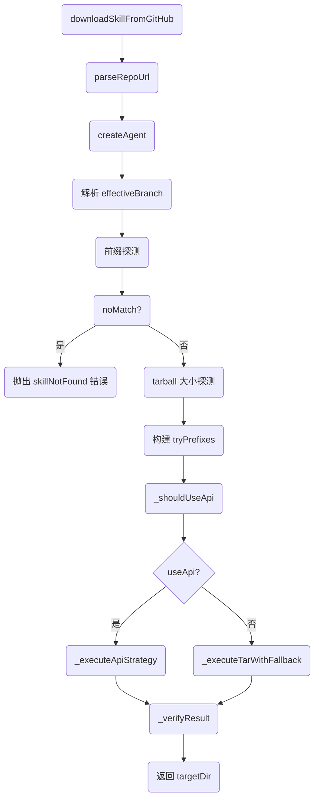

**关键点：**
1. 解析仓库 URL，提取 owner/repo
2. 创建 HTTP 代理 agent
3. 确定有效分支（显式传入 > tree URL 提取 > 默认 main）
4. 前缀探测：确定 skill 在仓库中的路径
5. 大小探测：获取 tarball 大小，用于策略路由
6. 策略选择：根据大小和文件数选择 Tar 或 API
7. 执行下载（含自动回退）
8. 最终验证：确认 SKILL.md 存在

---

## 3. 前缀探测：`detectSkillPrefix()`

确定 skill 在仓库中的路径前缀：

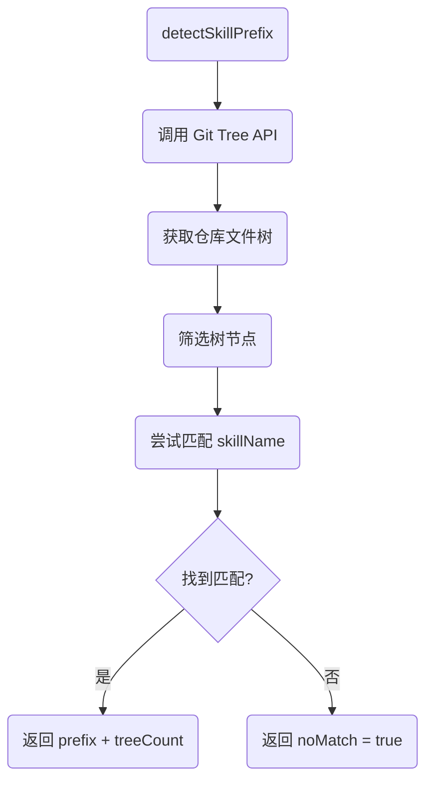

**关键点：**
- 通过 GitHub Git Tree API 获取仓库文件列表
- 筛选出以 skillName 开头的路径
- 返回匹配的前缀和总文件数

---

## 4. 大小探测：`detectTarballSize()`

获取 tar.gz 包大小，用于策略路由：

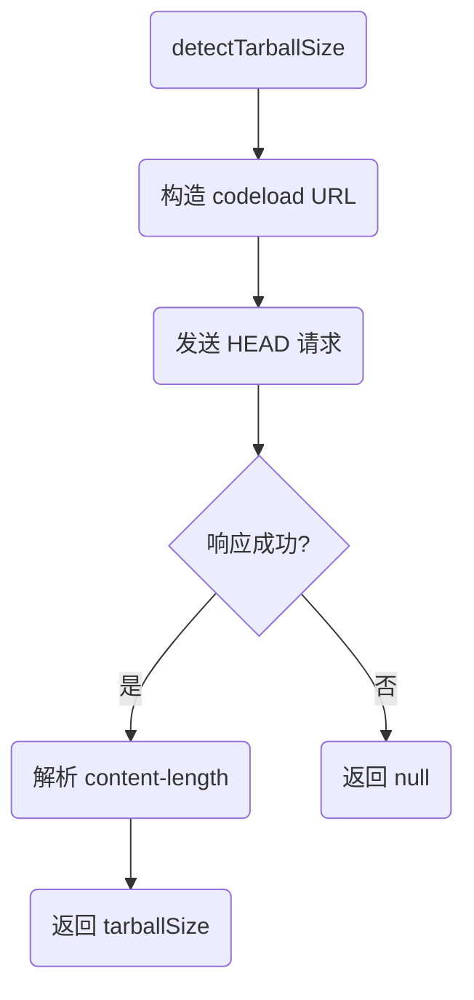

**关键点：**
- 使用 HEAD 请求获取 tar.gz 包大小
- 不下载整个包，只获取响应头
- 失败时返回 null，由策略路由根据文件数决定

---

## 5. 策略路由：`_shouldUseApi()`

根据 tarball 大小和文件数选择下载策略：

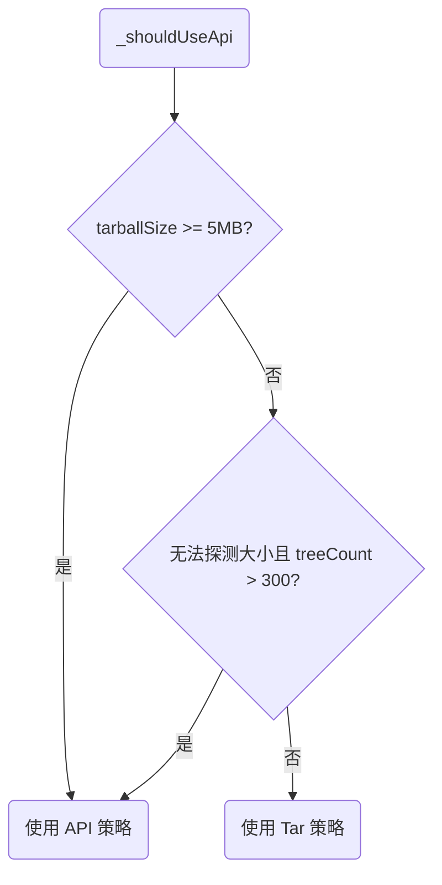

**关键点：**
- Tar 策略：tarball < 5MB，或无法探测大小且文件数 <= 300
- API 策略：tarball >= 5MB，或无法探测大小且文件数 > 300
- 5MB 和 300 是经验阈值，平衡下载速度和 API 请求数

---

## 6. Tar 下载流程：`downloadViaTar()`

通过 codeload.github.com 流式下载 tar.gz 并解压：

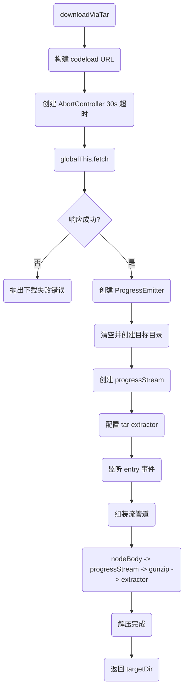

**关键点：**
1. 使用 codeload.github.com 的 tar.gz 流式下载服务
2. 30 秒超时控制
3. 流式解压，边下载边解压，节省内存和存储
4. 通过 filter 筛选出 skill 目录下的文件
5. 通过 map 应用 renameMap，将仓库路径映射到目标路径
6. 监听 entry 事件统计解压文件数并上报进度

---

## 7. API 下载流程：`downloadViaApi()`

通过 Octokit + Git Tree + Blob API 并发下载文件：

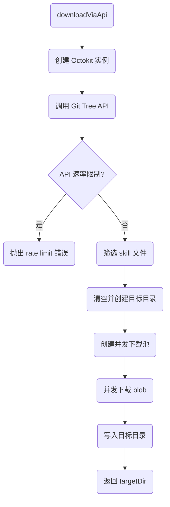

**关键点：**
1. 使用 Git Tree API 获取仓库文件列表
2. 筛选出以 skillPrefix 开头的 blob 文件
3. 通过 Git Blob API 并发下载每个文件内容
4. 使用 renameMap 映射路径后写入目标目录
5. 受 GitHub API 速率限制影响，未认证请求每小时限制 60 次

---

## 8. Tar 策略 + API 回退：`_executeTarWithFallback()`

Tar 策略失败时自动回退到 API 策略：

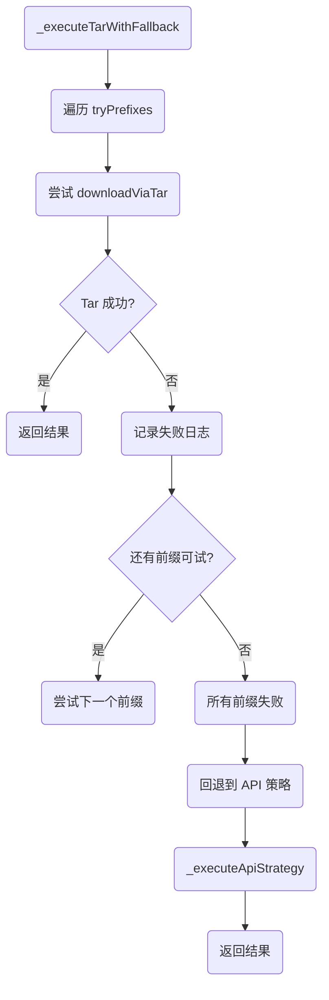

**关键点：**
1. 先尝试 Tar 策略
2. 如果 Tar 失败，尝试下一个前缀
3. 所有前缀都失败后，回退到 API 策略
4. API 策略作为最终保障

---

## 9. API 策略执行：`_executeApiStrategy()`

直接执行 API 策略，无回退：

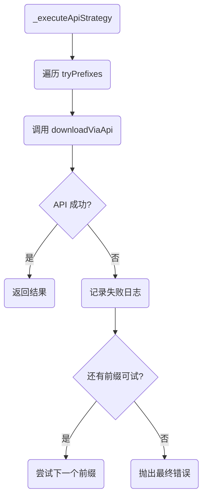

**关键点：**
1. 直接执行 API 策略
2. 尝试所有前缀
3. 所有前缀都失败后抛出错误

---

## 10. ZIP 下载流程：`downloadAndExtractZip()`

下载 ZIP 包并解压：

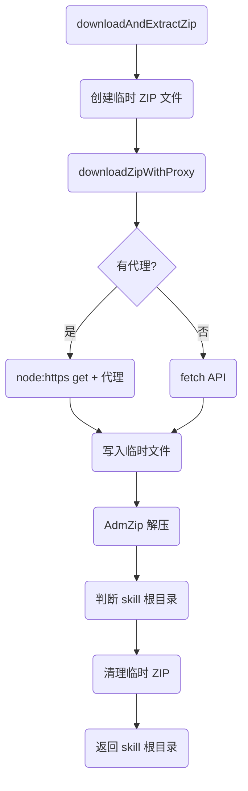

**关键点：**
1. 在系统临时目录创建临时 ZIP 文件
2. 支持两种下载模式：无代理（fetch）和有代理（node:https）
3. 支持 120 秒超时和 3xx 重定向
4. 使用 AdmZip 解压到目标目录
5. 判断 skill 根目录：如果只有一个子目录，返回该子目录
6. 清理临时 ZIP 文件

---

## 11. 最终验证：`_verifyResult()`

确认下载结果包含 SKILL.md：

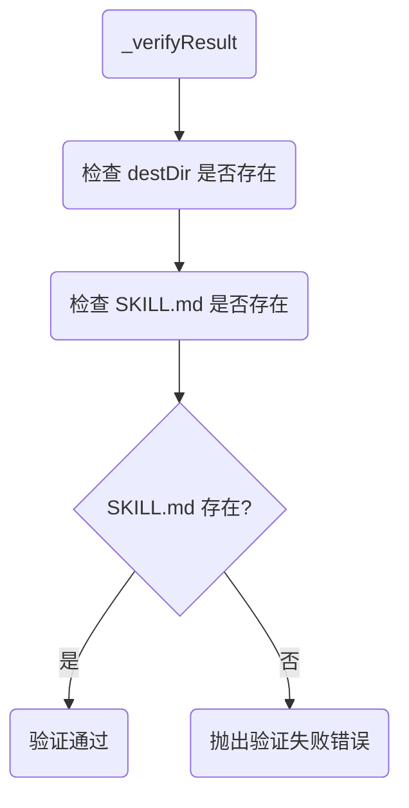

**关键点：**
- 确保下载结果包含 SKILL.md
- 如果验证失败，说明下载不完整或前缀匹配错误

---

## 12. 代理处理流程

### 12.1 `proxyToUrl()`

将结构化代理配置转换为 URL 字符串：

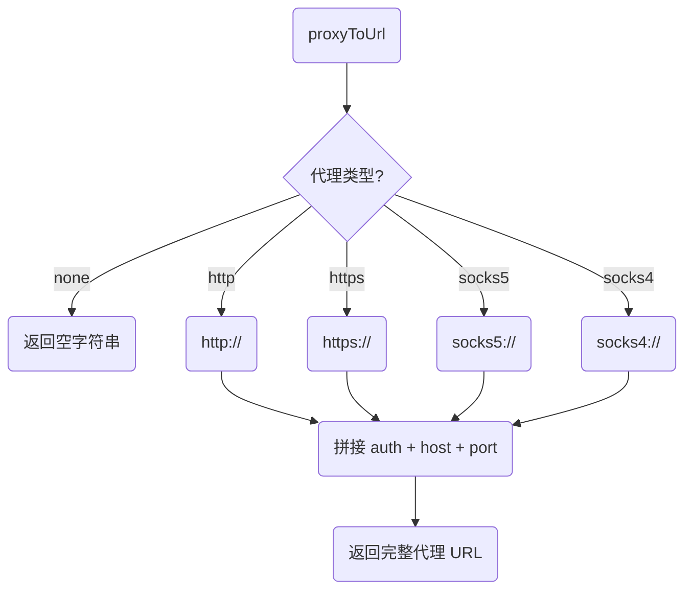

### 12.2 `createAgent()`

将结构化代理配置转换为 ProxyAgent 实例：

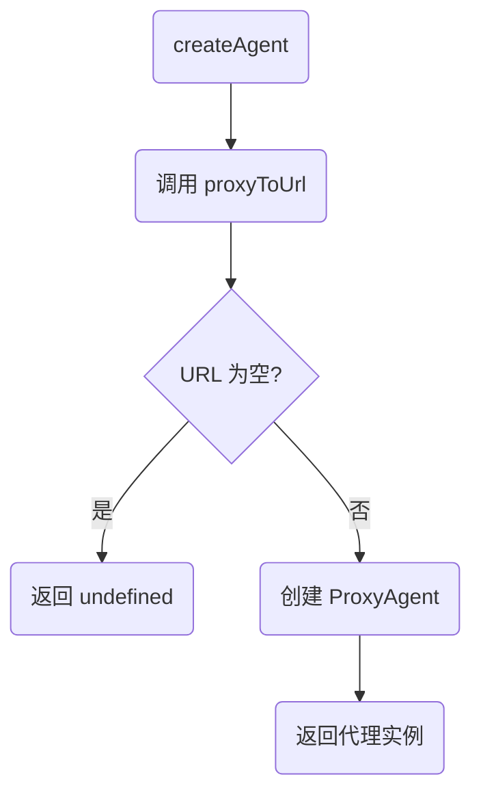

---

## 13. 进度发射：`ProgressEmitter`

统一管理下载进度上报，计算下载速度：

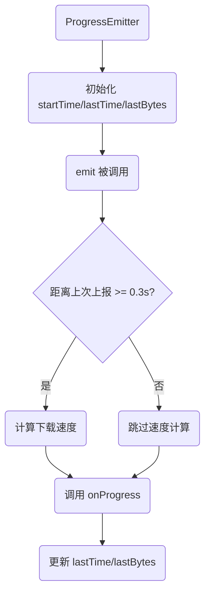

**关键点：**
- 使用滑动窗口算法计算下载速度
- 每 0.3 秒更新一次，避免速度值跳动过大
- 统一补齐进度事件缺省字段

---

## 14. 错误处理与回退

所有下载流程都遵循“探测失败 -> 回退策略 -> 最终验证”的原则：

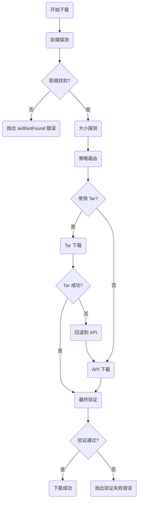

**关键点：**
1. 前缀探测失败直接终止
2. Tar 策略失败自动回退到 API 策略
3. 所有策略执行后必须通过最终验证
4. 验证失败说明下载不完整

---

## 15. 对照代码阅读建议

1. **先看 orchestrator 主入口**：`downloadSkillFromGitHub()` 函数（第 54-124 行）
2. **再看策略路由逻辑**：`_shouldUseApi()` 和 `_executeTarWithFallback()`（第 157-249 行）
3. **然后看 Tar 下载**：`downloadViaTar()` 函数（http.js 第 51-131 行）
4. **再看 API 下载**：`downloadViaApi()` 函数（http.js 第 166-250 行）
5. **然后看 ZIP 下载**：`downloadAndExtractZip()` 函数（zip.js）
6. **最后看工具函数**：`utils.js` 中的 `ProgressEmitter`、`proxyToUrl`、`createAgent`

每个函数内部的注释已经详细说明了每一步的用途，可以结合本文的流程图对照阅读。
