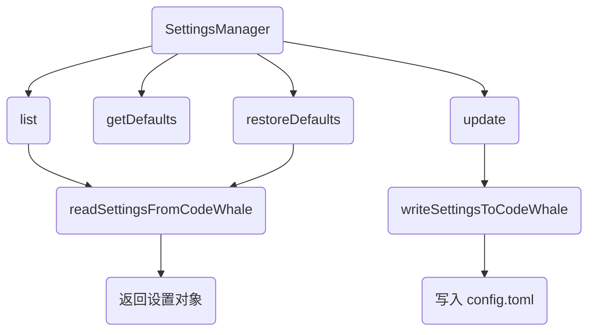
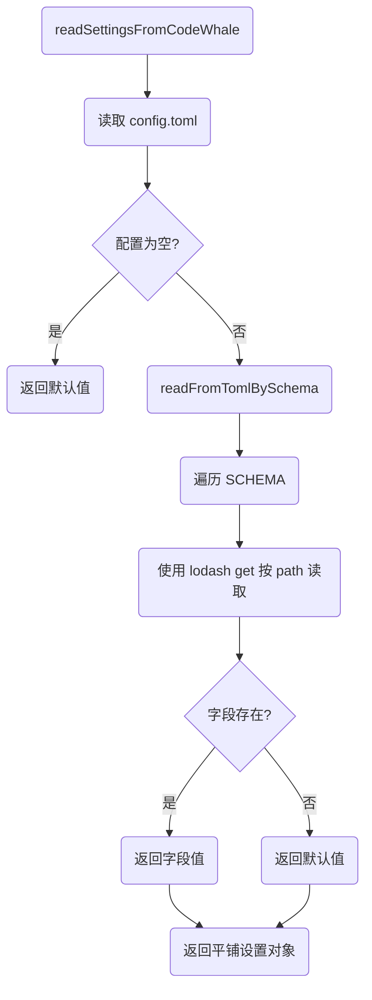
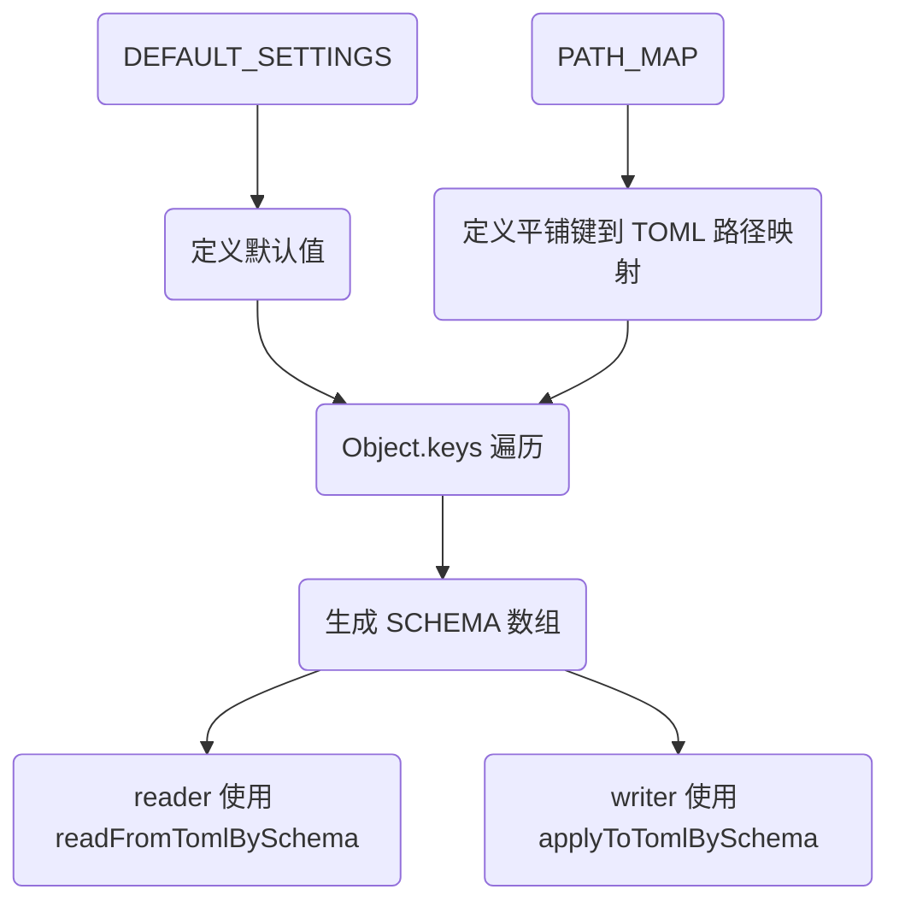

# Settings 通用设置模块说明

> 对应目录：`packages/core/src/settings/`
>
> 本文介绍 settings 模块的整体架构、各文件职责、Schema 驱动读写流程，方便对照代码阅读。

---

## 1. 整体架构

`settings/` 采用 **"Schema 驱动 + 统一 I/O"** 的结构，直接读写 CodeWhale `config.toml`，不经过本地 `store.json`：

- `index.js`：唯一对外入口，导出 `SettingsManager` 类
- `defaults.js`：通用设置默认值，与 CodeWhale `config.toml` 默认值保持一致
- `schema.js`：平铺键到 TOML 嵌套路径的声明式映射，自动生成 `SCHEMA`
- `reader.js`：从 CodeWhale `config.toml` 读取通用设置，映射为前端平铺结构
- `writer.js`：将前端平铺结构写回 CodeWhale `config.toml`
- `utils.js`：通用嵌套操作工具，基于 lodash 的清理/比较工具

核心原则：
- 新增字段只需在 `DEFAULT_SETTINGS` 和 `PATH_MAP` 中各加一行，`SCHEMA` 自动生成
- 智能写入：值与默认值相等则删除字段，使配置文件极简
- 非 `SCHEMA` 字段（如 `api_key`、`providers.*`）原样保留

---

## 2. 统一入口：`SettingsManager`

`SettingsManager` 直接操作 CodeWhale `config.toml`，封装通用设置的 CRUD：



**关键点：**
1. `list()`：获取当前通用设置，读取 `config.toml` 并映射为前端平铺结构
2. `getDefaults()`：获取通用设置默认值，直接返回 `DEFAULT_SETTINGS`
3. `restoreDefaults()`：恢复默认设置，写入 `config.toml` 后重新读取
4. `update(data)`：更新通用设置，智能写入后重新读取

---

## 3. 读取流程

`readSettingsFromCodeWhale()` 从 CodeWhale `config.toml` 读取通用设置：



**关键点：**
1. 使用 `readCodeWhaleConfig({})` 读取 `config.toml`
2. 配置为空时直接返回 `{ ...DEFAULT_SETTINGS }`
3. 使用 `readFromTomlBySchema` 按 `SCHEMA` 遍历读取
4. 字段不存在时使用 `field.default` 兜底
5. 读取失败时返回默认值

---

## 4. 写入流程

`writeSettingsToCodeWhale()` 将前端平铺结构写回 CodeWhale `config.toml`：

```mermaid
graph TD
    A(writeSettingsToCodeWhale) --> B(读取当前 config.toml)
    B --> C(深拷贝配置)
    C --> D(applyToTomlBySchema)
    D --> E(遍历 SCHEMA)
    E --> F{data[key] === undefined?}
    F -->|是| G(跳过)
    F -->|否| H{isEqual(value, default)?}
    H -->|是| I(lodash unset 删除字段)
    H -->|否| J(lodash set 写入字段)
    I --> K(清理空值)
    J --> K
    K --> L(写入 config.toml)
```

**关键点：**
1. 读取当前配置，保留所有非通用设置字段
2. 使用 `applyToTomlBySchema` 按 `SCHEMA` 遍历写入
3. 智能写入策略：值与默认值相等则删除字段，不相等则写入
4. 使用 `isEqual` 深比较，避免 `JSON.stringify` 的语义边界问题
5. 清理整个配置的空值（包括非 `SCHEMA` 字段的空对象/空数组/null/空字符串）
6. 原子写入文件

---

## 5. Schema 驱动机制

`schema.js` 根据 `DEFAULT_SETTINGS` 和 `PATH_MAP` 自动生成 `SCHEMA`：



**关键点：**
1. `DEFAULT_SETTINGS` 定义所有字段的默认值
2. `PATH_MAP` 定义平铺键到 TOML 嵌套路径的映射
3. `SCHEMA` 自动生成：`{ key, path, default }`
4. 新增字段只需在两个地方各加一行，无需修改 reader/writer

---

## 6. 智能写入策略

`applyToTomlBySchema` 使用深比较判断是否等于默认值：

```mermaid
graph TD
    A(applyToTomlBySchema) --> B(遍历 SCHEMA)
    B --> C{data[key] === undefined?}
    C -->|是| D(跳过)
    C -->|否| E{isEqual(value, default)?}
    E -->|是| F(unset 删除字段)
    E -->|否| G(set 写入字段)
```

**关键点：**
- 使用 `isEqual` 深比较，避免 `JSON.stringify` 的语义边界问题
- 使配置文件极简：只保留非默认值
- 非 `SCHEMA` 字段原样保留，不受影响

---

## 7. 对照代码阅读建议

1. **先看入口类**：`SettingsManager` 类定义和注释（index.js 第 1-54 行）
2. **再看默认值**：`DEFAULT_SETTINGS` 对象（defaults.js 第 1-110 行）
3. **然后看 Schema**：`PATH_MAP` 和 `SCHEMA` 生成逻辑（schema.js 第 1-80 行）
4. **然后看读取流程**：`readSettingsFromCodeWhale` 和 `readFromTomlBySchema`（reader.js 第 1-35 行，utils.js 第 1-40 行）
5. **然后看写入流程**：`writeSettingsToCodeWhale` 和 `applyToTomlBySchema`（writer.js 第 1-45 行，utils.js 第 42-80 行）
6. **最后看工具函数**：`utils.js` 中的 `clearObject`（utils.js 第 82-100 行）

每个函数内部的注释已经详细说明了每一步的用途，可以结合本文的流程图对照阅读。
