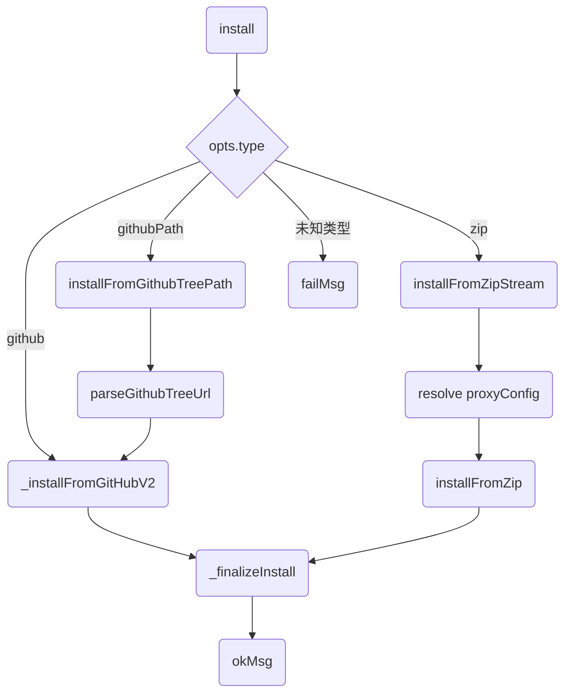
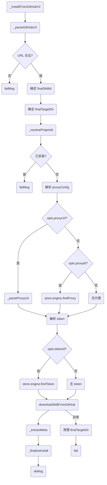
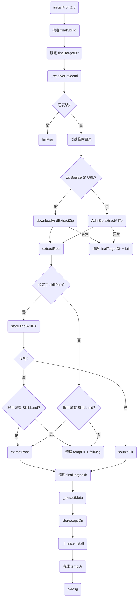
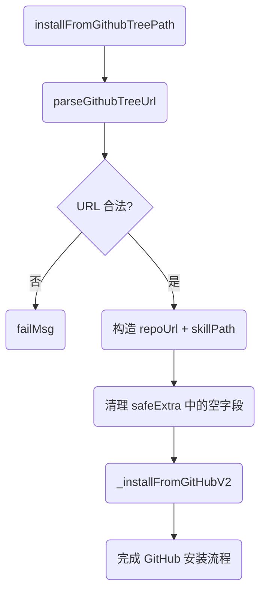
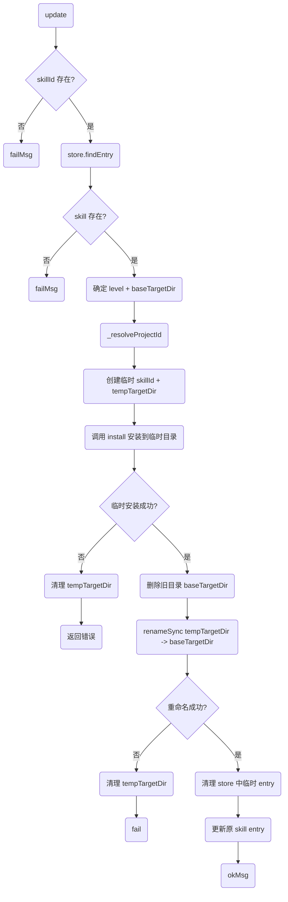
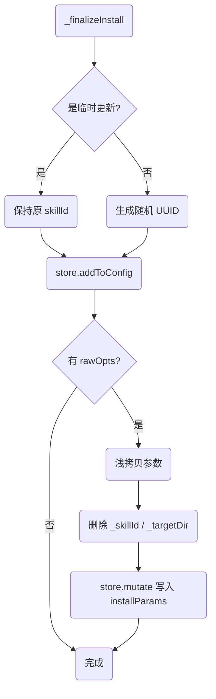
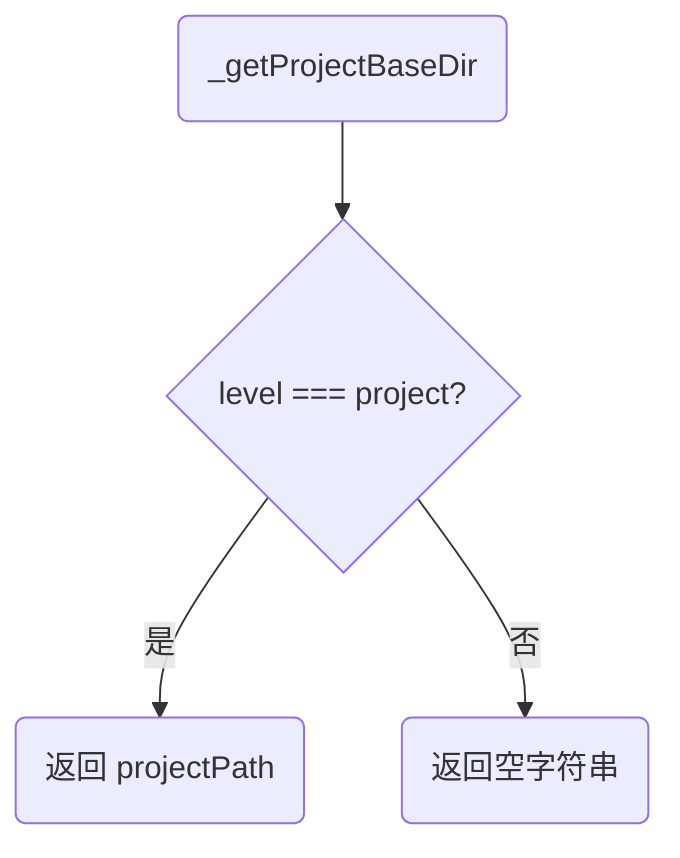
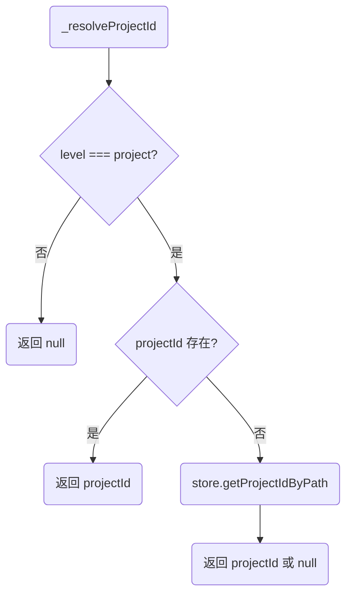
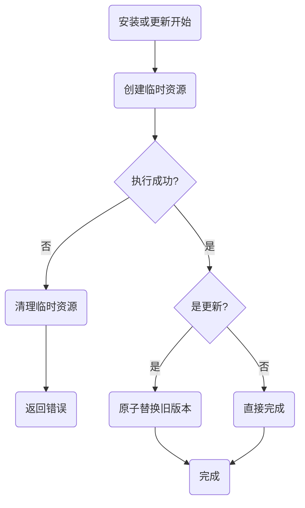

# Skill 安装与更新流程说明

> 对应文件：`packages/core/src/skill/install.js`
>
> 本文用 Mermaid 流程图解释 skill 安装与更新的完整流程，方便对照代码阅读。

---

## 1. 整体架构

`install.js` 采用“统一入口 + 多实现分支 + 原子更新”的结构：

- `install()`：统一入口，按 `type` 分发到不同安装方式
- `_installFromGitHubV2()`：从 GitHub 仓库安装
- `installFromZip()`：从 ZIP 源安装（远程 URL 或本地文件）
- `installFromGithubTreePath()`：从 GitHub Tree URL 安装（仓库子目录）
- `installFromZipStream()`：ZIP 安装的封装层，增加日志记录
- `update()`：安全原子替换更新

所有安装方式最终都通过 `_finalizeInstall()` 完成收尾（写入 store + 记录安装参数）。

---

## 2. 统一入口：`install()`

前端调用 `install()` 时，根据 `opts.type` 分发到不同的安装实现：

**关键点：**
- `githubPath` 先解析 Tree URL，再委托给 `_installFromGitHubV2`
- `zip` 先解析代理配置，再调用 `installFromZip`
- 所有分支最终都汇聚到 `_finalizeInstall`

---

## 3. GitHub 安装流程：`_installFromGitHubV2()`

从 GitHub 仓库安装 skill 的完整流程：

**关键点：**
1. 先解析 GitHub URL，提取 owner/repo
2. 确定 skillId 和安装目录
3. 检查是否已安装同名 skill
4. 解析代理配置（三种方式：proxyConfig / proxyUrl / proxyId）
5. 解析 Token（通过 tokenId）
6. 调用 `downloadSkillFromGitHub` 下载
7. 提取元数据并写入 store

---

## 4. ZIP 安装流程：`installFromZip()`

从 ZIP 源安装 skill，支持远程 URL 和本地文件：

**关键点：**
1. 创建临时解压目录
2. 远程 URL 下载并解压，本地文件直接解压
3. 定位 skill 目录（支持子目录路径）
4. 复制到目标目录
5. 清理临时文件

---

## 5. GitHub Tree Path 安装流程：`installFromGithubTreePath()`

安装仓库中特定目录下的 skill：

**关键点：**
- 先解析 Tree URL 提取 owner/repo/path/branch
- 构造标准 GitHub 仓库 URL
- 委托给 `_installFromGitHubV2` 完成实际安装

---

## 6. 更新流程：`update()` 原子替换

更新已安装 skill 的安全流程，采用“临时安装 + 原子替换”策略：

**关键点：**
1. 先安装到临时目录（带 `.tmp-` 后缀）
2. 临时安装成功后，删除旧目录
3. 重命名临时目录为正式目录
4. 清理 store 中的临时 entry
5. 更新原 skill entry 的路径和参数

**为什么需要原子替换？**
- 避免在更新过程中出现“旧文件已删、新文件未就位”的中间状态
- 如果临时安装失败，旧版本完全不受影响
- 重命名操作是文件系统级别的原子操作

---

## 7. 收尾流程：`_finalizeInstall()`

所有安装方式的最终收尾步骤：

**关键点：**
- 临时更新保持原 skillId，新安装生成 UUID
- 记录原始安装参数到 `installParams`，供前端回填表单
- 去掉内部字段 `_skillId` 和 `_targetDir`

---

## 8. 路径解析辅助流程

### 8.1 `_getProjectBaseDir()`

### 8.2 `_resolveProjectId()`

---

## 9. 各安装方式对比

| 安装方式 | 入口函数 | 数据源 | 适用场景 |
|---------|---------|--------|---------|
| GitHub 仓库 | `_installFromGitHubV2` | GitHub 仓库 | 安装公开 skill 仓库 |
| ZIP 文件 | `installFromZip` | 远程 ZIP URL 或本地 ZIP | 从 ZIP 包安装 |
| GitHub Tree Path | `installFromGithubTreePath` | GitHub 仓库子目录 | 安装仓库中特定目录的 skill |
| ZIP 流 | `installFromZipStream` | 本地 ZIP 文件 | 带日志的 ZIP 安装封装 |

---

## 10. 错误处理与清理

所有安装流程都遵循“失败清理”原则：

1. **临时目录清理**：安装过程中创建的临时目录，失败时必须清理
2. **目标目录清理**：如果目标目录已存在且安装失败，需要清理已部分写入的文件
3. **原子性保证**：update 流程通过临时目录保证原子性，失败不会影响旧版本

---

## 11. 对照代码阅读建议

1. **先看统一入口**：`install()` 函数（第 363-397 行）
2. **再看 GitHub 安装**：`_installFromGitHubV2()` 函数（第 108-184 行）
3. **然后看 ZIP 安装**：`installFromZip()` 函数（第 199-280 行）
4. **最后看更新流程**：`update()` 函数（第 413-490 行）

每个函数内部的注释已经详细说明了每一步的用途，可以结合本文的流程图对照阅读。
