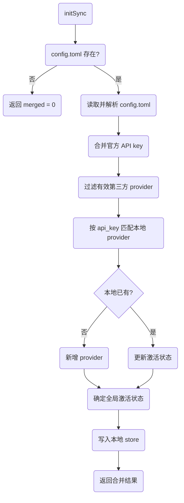
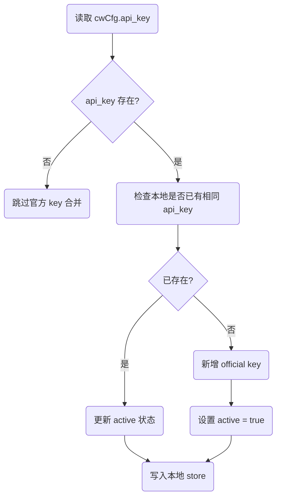
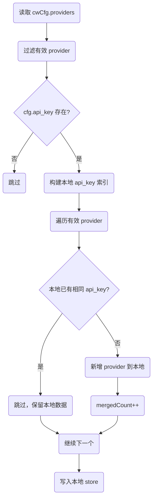
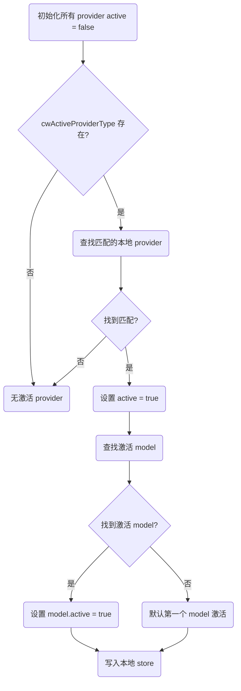
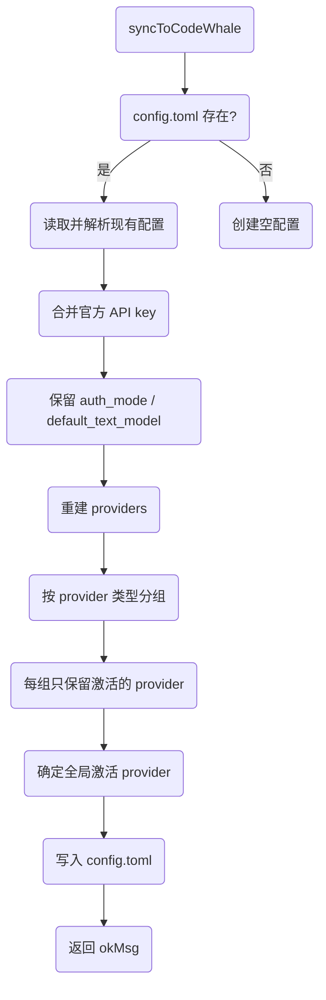
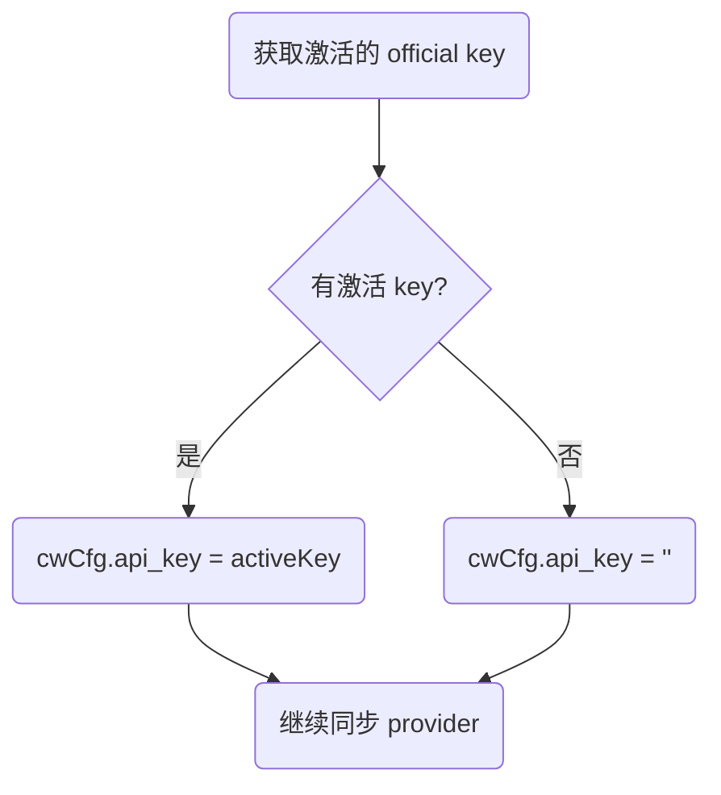
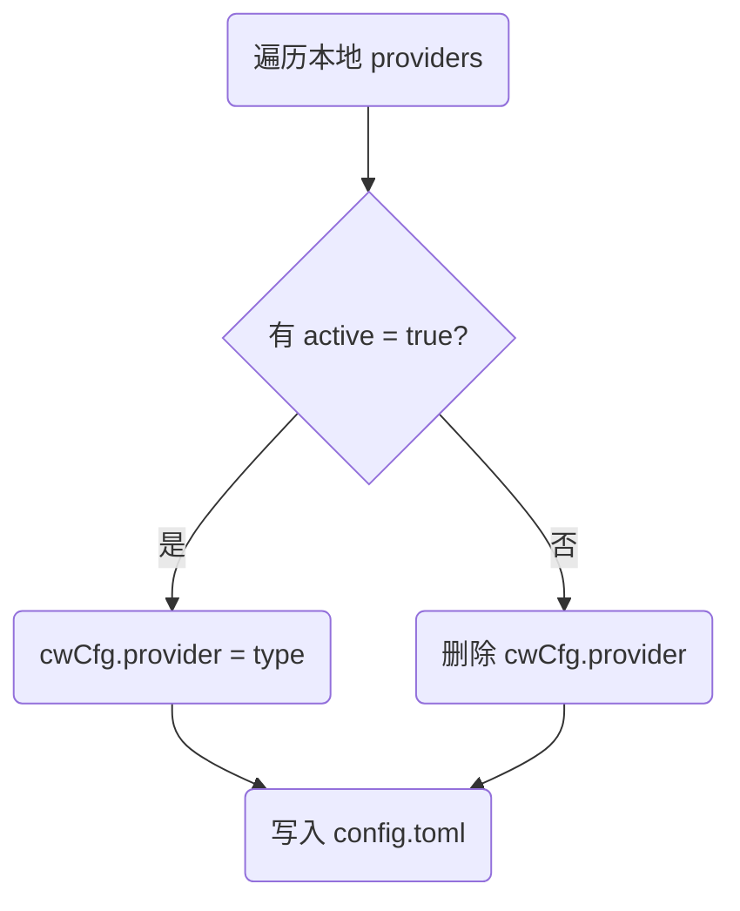
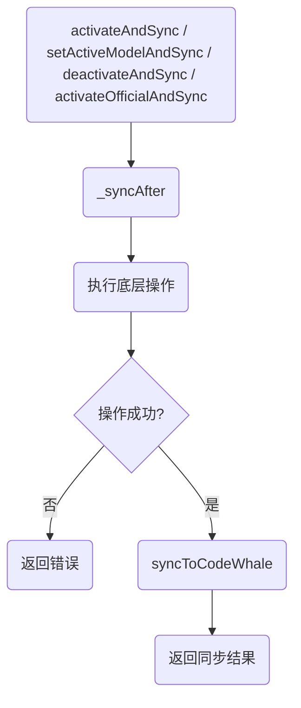
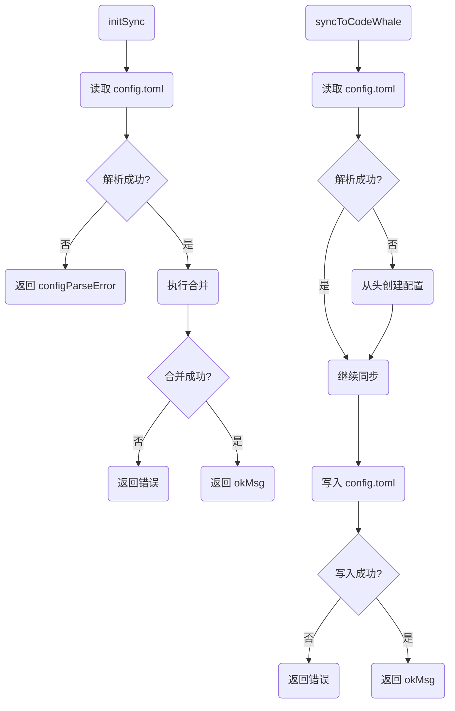

# Sync 同步流程说明

> 对应文件：`packages/core/src/sync.js`
>
> 本文用 Mermaid 流程图解释 SyncManager 的双向同步流程，方便对照代码阅读。

---

## 1. 整体架构

`sync.js` 实现 **store.json ↔ CodeWhale config.toml** 的双向同步：

- **启动时合并**：`initSync()` 从 `config.toml` 读取并合并到本地 `store.json`
- **实时同步**：`syncToCodeWhale()` 将本地配置实时写回 `config.toml`
- **组合操作**：`activateAndSync` / `setActiveModelAndSync` / `deactivateAndSync` / `activateOfficialAndSync` 在变更后自动同步

核心原则：
- 官方 key 和第三方 provider 按 `api_key` 去重合并
- 同步时保留 `auth_mode`、`default_text_model` 等非管理字段
- 所有消息已本地化

---

## 2. 启动时合并：`initSync()`

从 CodeWhale `config.toml` 读取并合并到本地 `store.json`：



**关键点：**
1. 官方 key：从 `config.toml` 的 `api_key` 字段读取，按 `api_key` 合并到 `official_keys`
2. 第三方 provider：按 `api_key` 匹配，本地有则保留不改，本地无则新增
3. 过滤 `http_headers` 等无 `api_key` 的空 provider
4. 根据 `provider` 字段和 `[providers.xxx].model` 确定激活状态

---

## 3. 官方 API key 合并流程



**关键点：**
- 如果本地已有相同 `api_key`，只更新 `active` 状态
- 如果本地没有，新增一条记录并设为激活
- `id` 格式为 `official:{api_key}`

---

## 4. 第三方 provider 合并流程



**关键点：**
- 只合并有 `api_key` 的 provider，过滤掉空配置
- 按 `api_key` 去重，本地已有则保留不改
- 新 provider 的 `id` 格式为 `{providerType}:{api_key}`

---

## 5. 激活状态确定流程



**关键点：**
- 先将所有 provider 设为 `active = false`
- 根据 `config.toml` 中的 `provider` 字段找到激活的 provider
- 根据 `[providers.xxx].model` 找到激活的 model
- 如果没有激活的 model，默认第一个 model 激活

---

## 6. 实时同步：`syncToCodeWhale()`

将本地配置实时写入 CodeWhale `config.toml`：



**关键点：**
1. 保留 `auth_mode`、`default_text_model` 等非管理字段
2. 官方 API key：写入激活的 `official_key`
3. 第三方 providers：完全用本地数据重建（清空后重写）
4. 同类型多 provider：每种 provider 类型只保留激活的那个，其余仅存本地

---

## 7. 官方 key 写入流程



**关键点：**
- 只写入当前激活的官方 key
- 如果没有激活的 key，清空 `api_key` 字段

---

## 8. 第三方 provider 写入流程

```mermaid
graph TD
    A(获取本地 providers) --> B(按 provider 类型分组)
    B --> C(遍历每组)
    C --> D(找组内激活的 provider)
    D --> E{有激活?}
    E -->|否| F(取组内第一个)
    E -->|是| G(取激活的)
    F --> H(获取激活 model)
    G --> H
    H --> I(写入 cwCfg.providers[type])
    I --> J(继续下一个类型)
    J --> K(确定全局激活 provider)
    K --> L(写入 config.toml)
```

**关键点：**
- 按 `provider` 类型分组，每组只保留一个 provider 写入 `config.toml`
- 优先取组内 `active = true` 的 provider，否则取第一个
- 写入 `api_key`、`base_url`、`model` 三个字段

---

## 9. 全局激活 provider 确定



**关键点：**
- 如果有激活的第三方 provider，写入 `provider` 字段
- 如果没有激活的第三方 provider，删除 `provider` 字段（使用官方 key）

---

## 10. 组合操作流程

`_syncAfter` 是组合操作的基座，确保变更后自动同步：



**关键点：**
1. 先执行底层操作（如激活 provider）
2. 如果底层操作成功，自动调用 `syncToCodeWhale`
3. 如果底层操作失败，不触发同步
4. 保证“变更 -> 同步”的原子性

---

## 11. 各组合操作说明

| 操作 | 底层调用 | 用途 |
|------|---------|------|
| `activateAndSync(providerId)` | `_providerMgr.activateProvider(providerId)` | 激活指定 provider 并同步 |
| `setActiveModelAndSync({id, name})` | `_providerMgr.setActiveModel({id, name})` | 切换 provider 的激活 model 并同步 |
| `deactivateAndSync()` | `_providerMgr.deactivateThirdParty()` | 停用所有第三方 provider 并同步 |
| `activateOfficialAndSync(id)` | `_officialKeyMgr.activate(id)` | 激活官方 key 并同步 |

---

## 12. 错误处理



**关键点：**
- `initSync`：如果 `config.toml` 不存在或解析失败，返回相应错误
- `syncToCodeWhale`：如果读取失败，从头创建配置；如果写入失败，返回错误
- 所有错误都通过 `failMsg` 返回，消息已本地化

---

## 13. 对照代码阅读建议

1. **先看整体架构**：`SyncManager` 类定义和注释（第 1-20 行）
2. **再看启动合并**：`initSync()` 函数（第 73-165 行）
3. **然后看实时同步**：`syncToCodeWhale()` 函数（第 180-238 行）
4. **最后看组合操作**：`_syncAfter` 和各组合方法（第 54-58 行，第 243-266 行）

每个函数内部的注释已经详细说明了每一步的用途，可以结合本文的流程图对照阅读。
